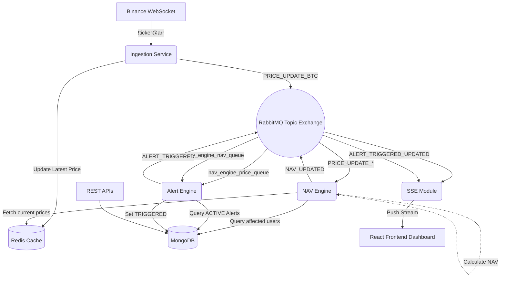

# Shipfinex - Real-Time Portfolio NAV Engine

## 📖 Project Overview
The **Portfolio NAV Engine** is a high-performance backend system built to manage tokenized crypto portfolios and provide real-time Net Asset Value (NAV) computations. It ingests live crypto ticks from Binance WebSockets, instantly recalculates portfolio valuations dynamically based on real holdings, and pushes those updates to connected clients using Server-Sent Events (SSE). It also features an Alert Engine to notify users when an asset or total NAV crosses a defined threshold.

---

## 🏛️ Architecture Diagram

Below is the system architecture showing how real-time ticks flow from Binance into the NAV Engine and ultimately out to the frontend clients via SSE.



---
### 🎥 Project Walkthrough

[View on Google Drive](https://drive.google.com/file/d/1B3tGGJYw9qmH1Xwo2HF2x29FDlWxCj0z/view?usp=sharing)

## 🚀 How to Run the Project (Step-by-Step Guide)

This project is fully containerized using Docker, making it incredibly easy to start with a single command. 

### Prerequisites
- **Docker** and **Docker Compose** installed on your machine.
  - *If you don't have Docker installed, please download it from [Docker's official repository](https://www.docker.com/products/docker-desktop/).*

### Step 1: Start the Applications
1. Open your terminal or command prompt.
2. Navigate to the root folder of this project (where the `docker-compose.yml` file is located).
3. Run the following command:
   ```bash
   docker-compose up --build -d
   ```
   *Note: The `--build` flag ensures latest code is built into the images, and `-d` runs the servers in detached mode (in the background).*

### Step 2: Access the Services
Once Docker has successfully downloaded the images and started the containers (MongoDB, Redis, RabbitMQ, Backend, Frontend), you can access the various parts of the system:

- 🖥️ **Frontend Dashboard**: [http://localhost:8080](http://localhost:8080)  
  *Open this in your browser to view and interact with the real-time UI.*
- ⚙️ **Backend API**: [http://localhost:3000](http://localhost:3000)  
  *The core NestJS REST and SSE API server.*
- 🐇 **RabbitMQ Management UI**: [http://localhost:15672](http://localhost:15672)  
  *(Login: `guest` / `guest`). View the message queues and topics.*

### Step 3: Stopping the Project
To stop the services and clean up the containers, run:
```bash
docker-compose down
```

---

## 🌊 Project Implementation Flow

Here is the step-by-step flow of how data moves through the architecture when the system is running:

### 1. Data Ingestion (Real-Time Crypto Prices)
- The **Ingestion Service** connects to the **Binance WebSocket** (`!ticker@arr`) to stream live cryptocurrency prices (e.g., BTC, ETH, SOL).
- When a price update is received, it is immediately cached in **Redis** (which acts as our incredibly fast, single source of truth for the latest prices).
- Simultaneously, it fires a `PRICE_UPDATE_{ASSET}` event into the **RabbitMQ Topic Exchange**.

### 2. NAV Calculation Engine
- The **NAV Engine** constantly listens to RabbitMQ for price updates.
- When an asset's price changes, the engine queries **MongoDB** to find all users who have a holding in that specific asset.
- For each affected user, it recalculates their *Total Portfolio Value* (NAV) by pulling the latest prices of *all* their holdings from Redis.
- The new calculated NAV is saved as a temporal snapshot in MongoDB, and a `NAV_UPDATED` event is published back to **RabbitMQ**.

### 3. Alert Monitoring Engine
- The **Alert Engine** listens to both the `PRICE_UPDATE` and `NAV_UPDATED` queues from RabbitMQ.
- It compares the incoming fresh prices/NAVs against active user-defined thresholds (e.g., "Alert me if BTC goes above $50,000" or "Alert me if my Total NAV drops below $10,000").
- If a condition is met, the alert status is atomically updated to `TRIGGERED` in MongoDB (to prevent duplicate firing), and an `ALERT_TRIGGERED` event is dispatched.

### 4. Real-Time Frontend Delivery (SSE)
- The **SSE (Server-Sent Events) Controller** maintains open HTTP connections with the connected **React Frontend** clients.
- It is subscribed to the `NAV_UPDATED` and `ALERT_TRIGGERED` event buses on RabbitMQ.
- When an event belonging to a specific connected user occurs, it instantly pushes the JSON payload down the stream to their browser.
- The React UI receives this payload and dynamically updates the dashboard numbers, charts, and alert toast notifications — all without the user ever needing to refresh the page.

---

## 🏗️ Architecture Stack
- **Frontend**: React (Vite), TailwindCSS
- **Backend Core**: Node.js, NestJS (TypeScript)
- **Database**: MongoDB (Mongoose) - *For persistent user data, holdings, and snapshots.*
- **Cache**: Redis - *For millisecond-speed price lookups.*
- **Message Broker**: RabbitMQ - *For decoupled microservice event routing.*
- **Real-Time Delivery**: Server-Sent Events (SSE) - *For pushing UI updates.*

---

## 📄 API Endpoints

### Portfolio & NAV
- `POST /portfolio/holdings` - Upsert a user holding
- `GET /portfolio/holdings/:userId` - Get a user's current holdings
- `GET /portfolio/nav/:userId` - Get current instantaneous NAV
- `GET /portfolio/nav/:userId/history` - Get historical NAV snapshots

### Alerts
- `POST /alert` - Create a new price/nav alert
- `GET /alert/:userId` - Get a user's alerts
- `POST /alert/:alertId/reset` - Reset a triggered alert to active

### Stream (SSE)
- `GET /stream/:userId` - Connect to the real-time Server-Sent Events stream
